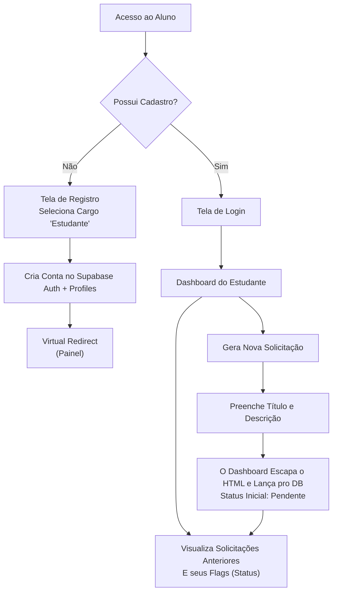
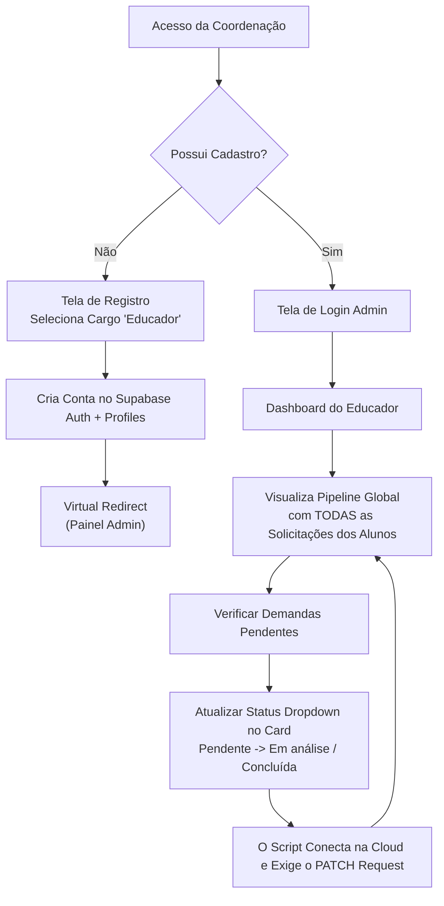

# ⚡ Portal Low Academy

**Atividade Avaliativa Low Code**  
Uma plataforma web desenvolvida com **HTML, CSS e JavaScript (Vanilla)** e integrada ao **Supabase** (Backend as a Service). O sistema tem como objetivo principal gerenciar o envio e controle de solicitações institucionais entre estudantes e a coordenação de uma escola de programação.

---

## 🎯 Objetivos do Projeto
- **Estudantes:** Podem se cadastrar, acessar um painel exclusivo, criar novas solicitações e acompanhar o histórico e status de seus requerimentos de forma centralizada.
- **Educadores / Coordenadores:** Possuem visão global de todas as requisições geradas na plataforma, podendo atualizar o status de cada uma em tempo real (Pendente, Em análise, Concluída).

---

## ⚙️ Tecnologias e Arquitetura de Software
1. **Frontend Nativo:** Construído de forma robusta e modularizada apenas com ESModules, sem engessamentos de bibliotecas externas React ou Angular. O visual foi estruturado com Glassmorphism CSS3 moderno e Skeletons guiados por animação para compor UX limpa.
2. **Supabase (DbaaS):** 
   - Gerência de identidade segura e Sessões JWT (Auth API).
   - Banco de Dados PostgreSQL relacional operado nativamente através do Data Gateway.
3. **Barreira Anti-Vírus e Segurança Perimetral (XSS Shield):** 
   - Evitamos Injeções DOM-Based mal-intencionadas criadas por estudantes. A proteção é imposta centralmente (`utils.js`), isolando as entradas nativas convertendo em tags virtuais escapadas. 
4. **Desempenho (Performance Tunneling):** 
   - Eliminados os gargalos e atrasos de servidor pelo uso estrito de HTML-Hacks (`<link rel="preconnect">`). Agiliza a comunicação paralela Web Socket com a infraestrutura no exterior antes de exibir o CSS à tela.
5. **Helpdesk Corporativo (Arquitetura V3):** 
   - O sistema comporta *Rastreabilidade Total (Audit Trail)*. As aberturas exigem *Categorias* afuniladas de contexto, e ambas as visualizações são dominadas por uma robusta Linha do Tempo (Apoiada em *CSS Psueudomarkers* e inner joins SQL à tabela `request_history`), detalhando e expondo comentários judiciais de Coordenação a nível cronometrado em segundos, garantindo a transparência vital no Atendimento.

---

## 🗺️ Fluxo de Abstração (Process Modeling)

### 1. Vida e Operação - Estudante


### 2. Vida e Operação - Educador / Coordenador


---

## 🗂️ Estrutura de Diretórios da Implementação
```text
Atividade Avaliativa Low Code/
├── .gitignore               # Arquivamento de pastas e arquivos ignorados no controle de versão Git
├── README.md                # Este documento introdutório direcionado aos repositórios de source-control.
├── DOCUMENTACAO.md          # Estudo e Documentação Global Avançada Adicional (Infra/V2).
├── index.html               # Landing page inicial transparente (Auto-redirecionamento de Stateful Sessions).
├── login.html               # Página de Login e Registro combinadas (UI Toggles).
├── dashboard_student.html   # Painel restrito as transações isoladas do Aluno.
├── dashboard_educator.html  # Painel de CRUD de coordenação (Restrito Educador).
├── css/
│   └── style.css            # Folhas de estilo Universal Premium (Dark mode Glass).
└── js/
    ├── auth.js              # Controlador Autoritativo de Credenciais via Provider/Supabase.
    ├── educator.js          # Motor da tela de aprovação com Nested SQL Joins e PATCH.
    ├── student.js           # Motor Transacional, responsável por gerenciar históricos do UUID atrelado.
    ├── supabaseClient.js    # Gateway e Middlewares de Interconexão Cloud.
    └── utils.js             # Módulo Utilitário de Prevenção a XSS (Sanitização) e UX Skeletons.
```